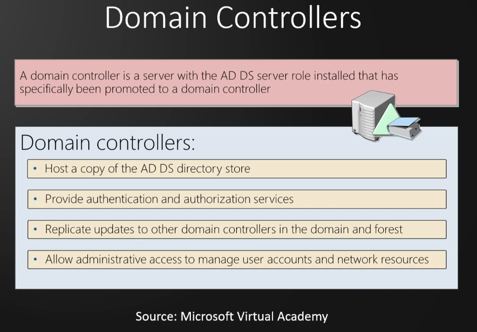
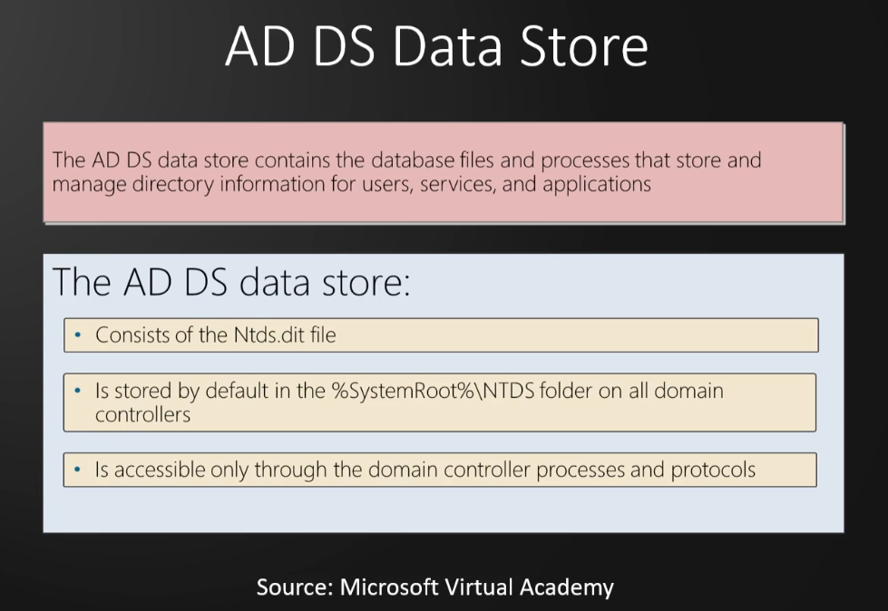
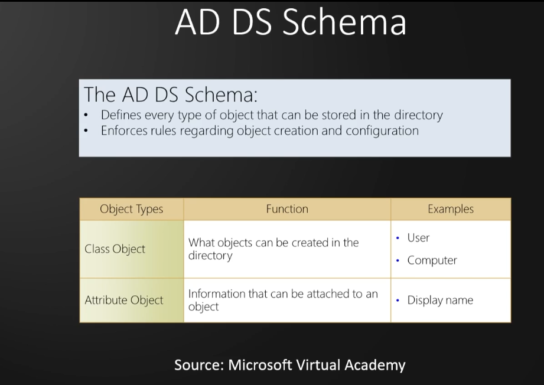
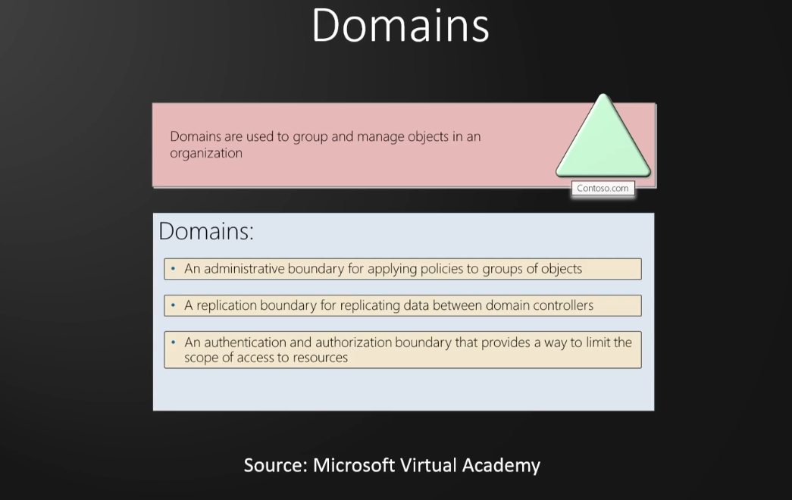
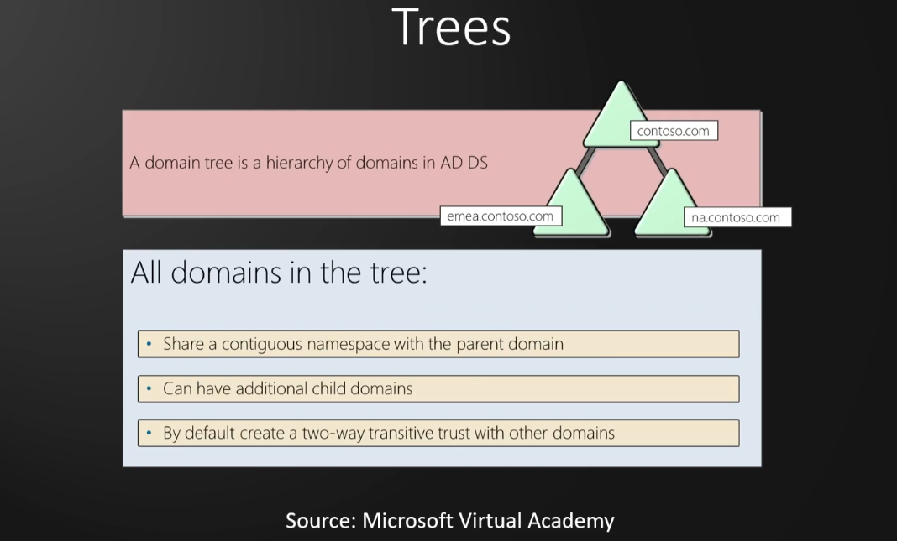
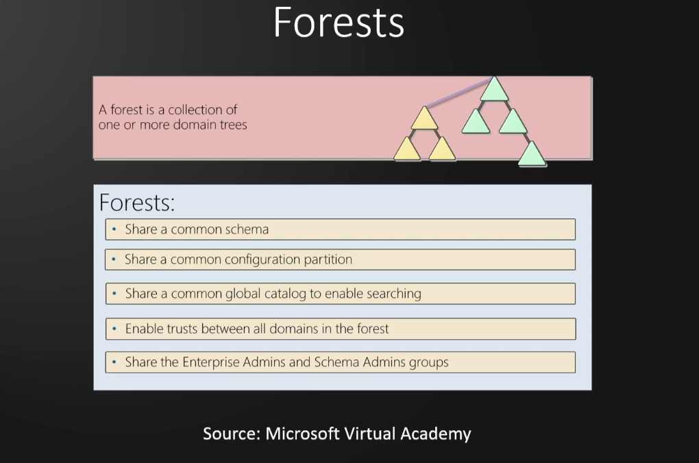
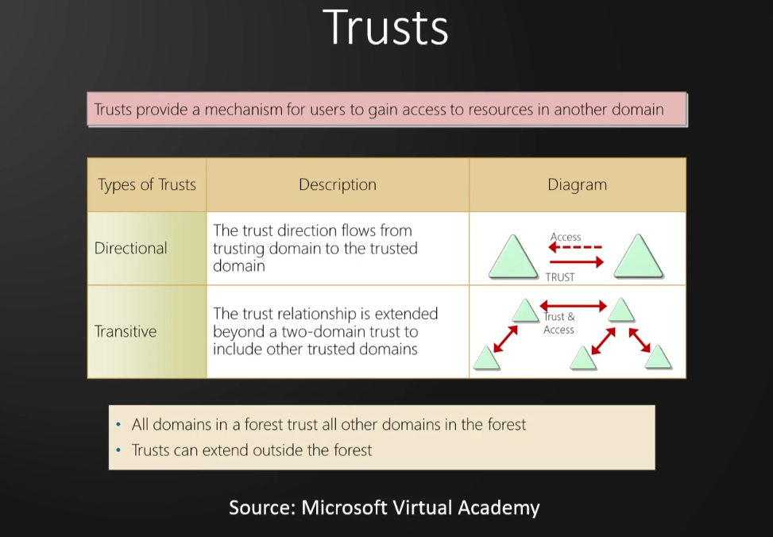
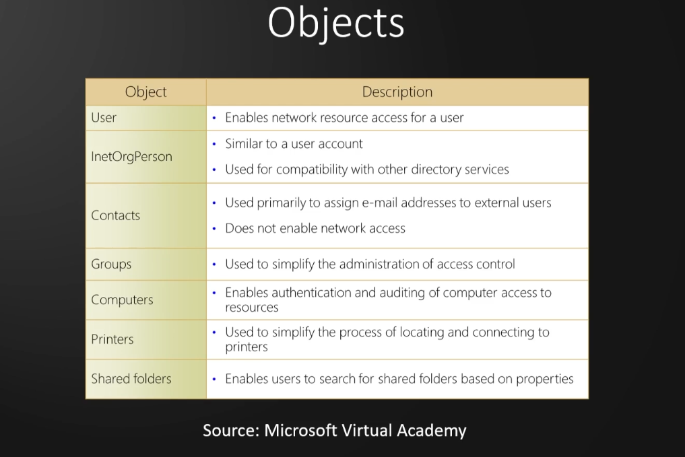

# Active Directory Overview and Lab Set Up

### AD Overview

Internal Penetration testing

**What is Active Directory?**

- Directory service developed by Microsoft to manage Windows domain networks
- Stores information related to objects, such as Computers, Users, Printers, etc. Think of it as a phone book 
for Windows
- Authenticates using Kerberos tickets. Non-Windows devices, such as linux machines, firewalls, etc. can also 
authenticate to AD via RADIUS or LDAP

**Why Active Directory?**

- Active Directory is the most commonly used identity management service in the world. 95% of Fortune 1000 
companies implement the service in their networks
- Can be exploited without ever attacking patchable exploits. Instead, we abuse features, trusts, components, 
and more

### Physical Active Directory Components

Active Directory Components

AD is composed of both physical and logical components

|Physical|
|---------|
|Data store|
|DCs|
|Global catalog server|
|Read-Only DC (RODC)|

Domain Controllers

AD DS Data Store

### Logical Active Directory Components

|Logical|
|-------|
|Partitions|
|Schema|
|Domains|
|Domain trees|
|Forests|
|Sites|
|Organisational units (OUs)|

### Active Directory Lab Build

1 x Windows Server 2022
2 x Windows 10 Workstations

Cloud based Lab in Azure https://kamran-bilgrami.medium.com/ethical-hacking-lessons-building-free-active-directory-lab-in-azure-6c67a7eddd7f

### Necessary ISOs

Enter dummy data when asked. Real email, phone, etc. not needed

[Microsoft Evaluation Center](https://www.microsoft.com/en-us/evalcenter)

[Windows Server 2022](https://info.microsoft.com/ww-landing-windows-server-2022.html)
[Windows 10 Enterprise](https://www.microsoft.com/en-us/evalcenter/download-windows-10-enterprise)

### Setting Up the Domain Controller

Remove floppy from hardware after VM creation, increase memory to 4-8Gb

Windows Server 2022 Evaluation Standard (Desktop experience), custom installation.
At drive creation add New and apply then install

Install VMWare tools and rename the DC, then reboot

**Promote the server to Domain Controller**

Select Manage -> Add Roles and Features

**Add Roles and Features Wizard**

Before You Begin: Default
Installation type: Role based or Feature based
Server Selection: Default
Server Roles: Active Directory Domain Services
Features: Default
AD DS: Default
Confirmation: Check restart if required
Results: When finished, click "Promote this server to a domain controller"

**Deployment Configuration Wizard**

Deployment Configuration: Select "Add a new forest" and enter the Root domain name (domain_name.local)
Domain Controller Options: Set the Directory Services Restore Mode (DSRM) password (same as Admin password)
DNS Options: Default
Additional Options: Default after the NetBIOS domain name loads
Paths: Default
Review Options: Default
Prerequisites Check: Install

Server will reboot after installation

**Add Active Directory Certificate Services**

Allows us to use LDAPS instead of LDAP

Select Manage -> Add Roles and Features 

**Add Roles and Features Wizard**

Before You Begin: Default
Installation type: Role based or Feature based
Server Selection: Default
Server Roles: Active Directory Certificate Services
Features: Default
AD CS: Check Certification Authority is checked, then Default
Confirmation: Check restart if required
Results: Configure Active Directory Certificate Services

**AD CS Configuration**

Credentials: Default
Role Services: Check Certification Authority, then Default
Setup Type: Default
CA Type: Default
Private Key: New private key
Cryptography: Default
CA Name: Default
Validity Period: Increase to 99 years, then Default
Certificate Database: Default
Confirmation: Configure

Reboot the Server

### Setting Up the User Machines

Windows 10 Enterprise

Remove floppy after VM creation, increase memory to 4-8Gb
Custom installation, at drive creation add New and apply then install.

Install OS then change PC name and reboot

### Setting Up Users, Groups, and Policies

Create a new "Groups" OU and move built in groups into it
Create 2 Administrator copies, one normal Admin and a service account (with the password in the description)
Create 2 low level users

Create an SMB share, navigate to the File and Storage Services tab -> Shares -> Tasks -> New Share

**New Share Wizard**

Select Profile: SMB Share Quick
Share Location: Default
Share Name: Name the share
Other Settings: Default
Permissions: Default
Confirmation: Create

Open cmd as Administrator and run the following command to set up the SQL service for kerberoasting:

`setspn -a HYDRA-DC/svc_sql.MARVEL.local:60111 MARVEL\svc_sql`

Check that the SQL service SPN is set up:

`setspn -T MARVEL.local -Q */*`

**Set Up GPO To Disable Windows Defender**

Open Group Policy Management tool -> Right-click on Domain -> Select "Create a GPO in this domain.."

Name the policy Disable Windows Defender -> Right-click and Edit 

Computer Configuration -> Policies -> Administrative Templates -> Microsoft/Windows Defender Antivirus

Select "Turn off Microsoft/Windows Defender Antivirus" and enable it then apply

Right-click the "Disable Windows Defender" GPO and select Enforced

**Set Static IP**

Check current IP with `ipconfig`, Open Network and Internet settings -> Change Adapter Options

Double-click Ethernet0 -> Properties -> Internet Protocol Version 4 (TCP/IPv4) -> Properties

Select Use the following IP address and change the values to match the result of `ipconfig`

This will remove internet access

Shut down DC

### Joining Our Machines to the Dommain

Access School or Work -> Connect to Local Domain -> Authenticate as Administrator to MARVEL.local domain

Log in to THEPUNISHER and SPIDERMAN as Marvel\Administrator

**THEPUNISHER (Mis)Configuration**

Open Local Users and Groups manager (lusrmgr)
Enable local Administrator account by setting a password and unchecking the disable option
Add MARVEL\fcastle to the local Administrators Group

Turn on Network discovery to access file shares on the domain

**SPIDERMAN (Mis)Configuration**

Open Local Users and Groups manager (lusrmgr)
Enable local Administrator account by setting a password (same as local Administrator account on 
THEPUNISHER) and unchecking the disable option
Add MARVEL\pparker and MARVEL\fcastle to the local Administrators Group

Turn on Network discovery to access file shares on the domain

Log in to SPIDERMAN as local account peterparker (`.\peterparker`)

Navigate to This PC -> Computer tab -> Map network drive
Map to `\\HYDRA-DC\hackme` with reconnect at sign in and use different credentials checked
Authenticate to the share with Domain Administrator account with remember me checked
