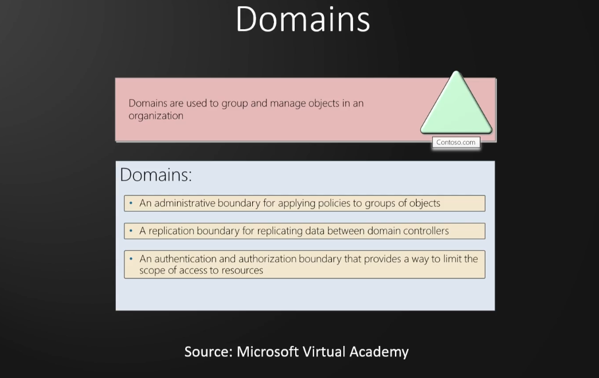
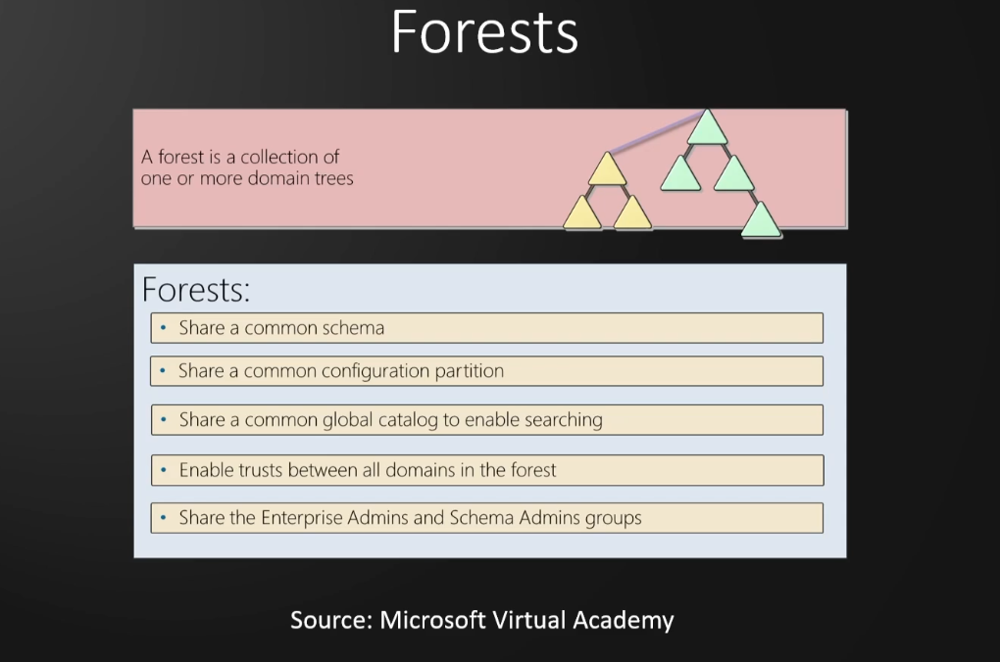
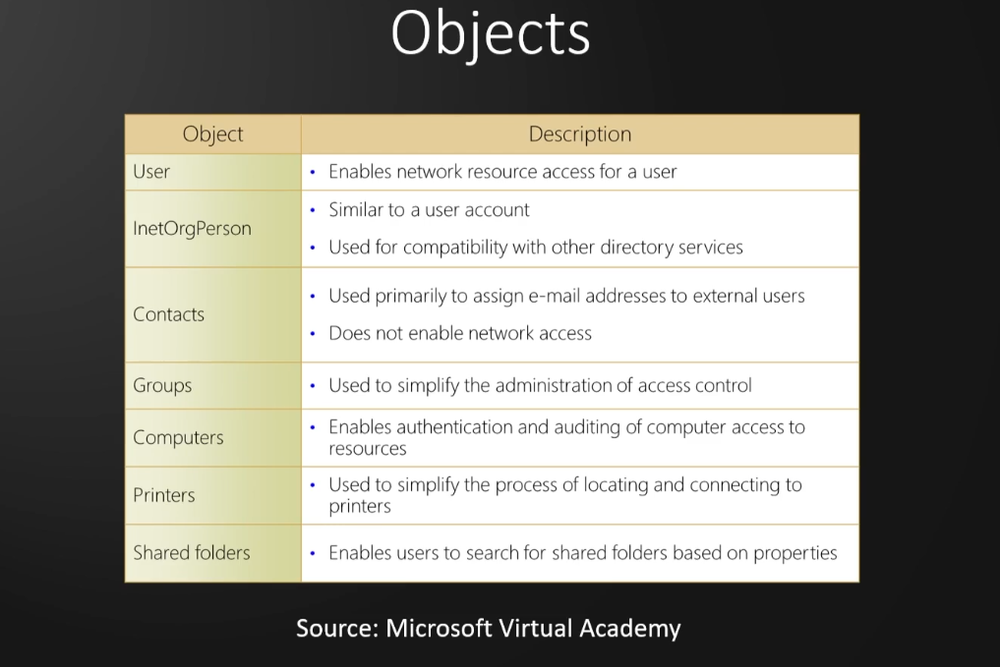

# Active Directory

### AD Overview

Internal Penetration testing

**What is Active Directory?**

- Directory service developed by Microsoft to manage Windows domain networks
- Stores information related to objects, such as Computers, Users, Printers, etc. Think of it as a phone book 
for Windows
- Authenticates using Kerberos tickets. Non-Windows devices, such as linux machines, firewalls, etc. can also 
authenticate to AD via RADIUS or LDAP

**Why Active Directory?**

- Active Directory is the most commonly used identity management service in the world. 95% of Fortune 1000 
companies implement the service in their networks
- Can be exploited without ever attacking patchable exploits. Instead, we abuse features, trusts, components, 
and more

### Physical Active Directory Components

Active Directory Components

AD is composed of both physical and logical components

|Physical|
|---------|
|Data store|
|DCs|
|Global catalog server|
|Read-Only DC (RODC)|

Domain Controllers

AD DS Data Store

### Logical Active Directory Components

|Logical|
|-------|
|Partitions|
|Schema|
|Domains|
|Domain trees|
|Forests|
|Sites|
|Organisational units (OUs)|

### Active Directory Lab Build

1 x Windows Server 2022
2 x Windows 10 Workstations

Cloud based Lab in Azure https://kamran-bilgrami.medium.com/ethical-hacking-lessons-building-free-active-directory-lab-in-azure-6c67a7eddd7f

### Necessary ISOs

Enter dummy data when asked. Real email, phone, etc. not needed

[Microsoft Evaluation Center](https://www.microsoft.com/en-us/evalcenter)

[Windows Server 2022](https://info.microsoft.com/ww-landing-windows-server-2022.html)
[Windows 10 Enterprise](https://www.microsoft.com/en-us/evalcenter/download-windows-10-enterprise)

### Setting Up the Domain Controller
