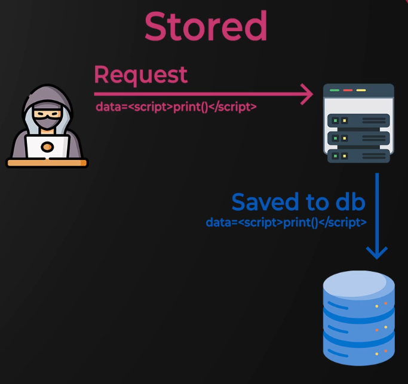

# XSS

### XSS - Introduction

Allows JavaScript execution within a victim's browser

3 main types:

- Reflected

- Stored

- DOM-based

Use print() or prompt("hello") to test XSS instead of alert(1) as it is now frequently filtered and detected

Look at [w3schools JavaScript tutorials](https://www.w3schools.com/js/)

### XSS - DOM Lab

No network activity in the network tab indicates DOM-based XSS

Basic payload

``

Error based payload

``

Redirect payload

Simulates a mouse click

``

Simulate a redirect

``

Replace removes the URL of the current document from the document history, meaning it is not possible to use 
the "back" button to navigate back

### XSS - Stored Lab

Use Firefox containers to isolate browser tabs for easy testing

Test for HTML injection first then figure out how to evade any XSS filtering

Set cookies to HttpOnly

### XSS - Challenge Lab

Start nc listener on port 8080

`nc -lnvp 8080`

Payload for Support ticket text box:

``
