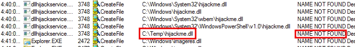

# Escalation Path: DLL Hijacking

### Overview and Escalation via DLL Hijacking

Look for processes that try to load DLLs, the name is not found, and the path is writable by the user

We can create a malicious DLL and give it the same name as the DLL that the executable is attempting to load 
and place it in the path where it's looking

[Malicious DLL](./windows_dll.c)  
  

Compile the DLL:

`x86_64-w64-mingw32-gcc windows_dll.c -shared -o hijackme.dll`

When the dllhijackservice starts it will attempt to load hijackme.dll, executing the payload
