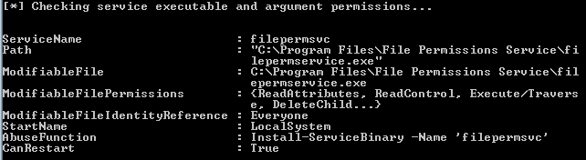
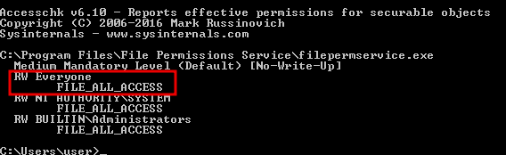

# Escalation path: Executable Files

### Overview of TryHackMe Labs

Windows PrivEsc Lab - https://tryhackme.com/room/windowsprivescarena

Built with lpeworkshop - https://github.com/sagishahar/lpeworkshop

### Executable Files Overview

PowerUp's Invoke-AllChecks shows any services that the current user has the necessary permissions to modify 
executables and arguments

We can check specific permissions with `accesschk64.exe`

`C:\Path\To\File\accesschk64.exe -wvu "C:\Program Files\File Permissions Service"`

Upload the malicious service executable that adds the current user as an Administrator using a Python HTTP 
server, and save the file with IE overwriting the existing service executable

Start the service with `sc start` and verify with `net localgroup administrators`

