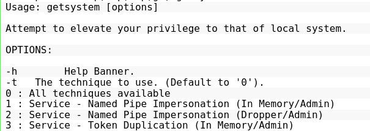

# Escalation Path: getsystem

### getsystem Overview

Blog - https://www.cobaltstrike.com/blog/what-happens-when-i-type-getsystem

Meterpreter getsystem attempts to elevate privileges to system

**Technique 1:**

Creates a named pipe from meterpreter. [It also creates and runs a service](https://github.com/rapid7/meterpreter/blob/master/source/extensions/priv/server/elevate/namedpipe.c) that runs 
`cmd.exe /c echo “some data” >\\.\pipe\[random pipe here]`. When the spawned cmd.exe connects to 
Meterpreter’s named pipe, Meterpreter has the opportunity to impersonate that security context. 
[Impersonation of clients](https://learn.microsoft.com/en-us/windows/win32/ipc/impersonating-a-named-pipe-client) is a named pipes feature. The context of the service is SYSTEM, so when you impersonate it, you 
become SYSTEM.

**Technique 2:**

It creates a named pipe and impersonates the security context of the first client to connect to it. To create 
a client with the SYSTEM user context, this technique drops a DLL to disk(!) and schedules rundll32.exe as a 
service to run the DLL as SYSTEM. The DLL connects to the named pipe and that’s it. Look at 
[elevate_via_service_namedpipe2](https://github.com/rapid7/meterpreter/blob/master/source/extensions/priv/server/elevate/namedpipe.c) in Meterpreter’s source to see this technique.

Will get picked up by AVs and should not be used outside of CTFs!

**Technique 3:**

[This technique](https://github.com/rapid7/meterpreter/blob/master/source/extensions/priv/server/elevate/tokendup.c) assumes you have SeDebugPrivileges — something getprivs can help with. It loops through all open 
services to find one that is running as SYSTEM and that you have permissions to inject into. It uses 
[reflective DLL injection](https://www.ired.team/offensive-security/code-injection-process-injection/reflective-dll-injection) to run its [elevator.dll](https://github.com/rapid7/meterpreter/blob/master/source/elevator/tokendup.c) in the memory space of the service it finds. This technique 
also passes the current thread id (from Meterpreter) to elevator.dll. When run, elevator.dll gets the SYSTEM 
token, opens the primary thread in Meterpreter, and tries to apply the SYSTEM token to it.

This technique’s implementation limits itself to x86 environments only. On the bright side, it does not 
require spawning a new process and it takes place entirely in memory.
