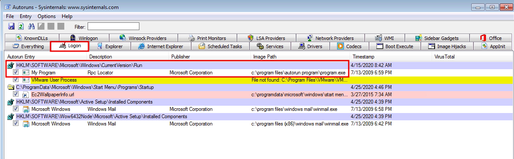
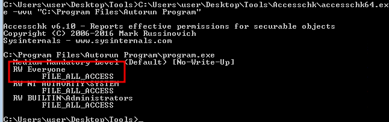
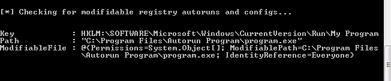

# Escalation path: Registry

### Overview of Autoruns

Check autorun targets with Sysinternals `Autoruns64.exe`. This opens a GUI showing all Autorun entries in the
registry

The Logon tab shows programs that autorun at log on



We can check the permissions on any interesting autoruns with Sysinternals `accesschk64.exe`. We're looking 
for executables with `RW Everyone FILE_ALL_ACCESS` 

`C:\Path\To\Sysinternals\Accesschk\accesschk64.exe -vwu "C:\Program Files\Autorun Program"`



We can also use PowerUp's `Invoke-AllChecks` to find modifiable registry autoruns

```
C:\>powershell -ep bypass
PS C:\>. .\PowerUp.ps1
PS C:\>Invoke-AllChecks
```



### Escalation via Autorun

