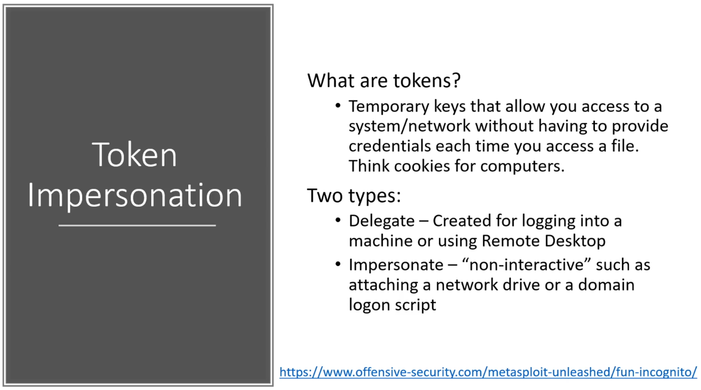
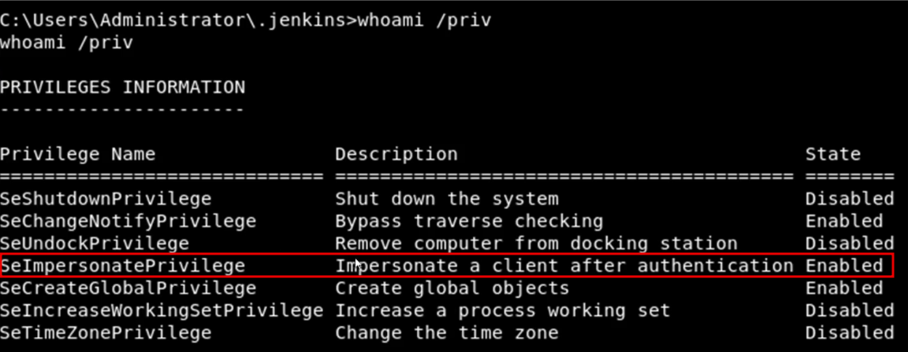
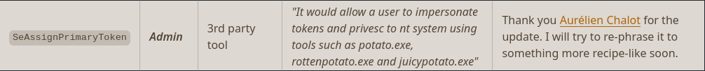

# Impersonation and Potato Attacks

### Token Impersonation Overview

### Impersonation Privileges Overview

Look for impersonate privileges:

`whoami /priv`

Go through the following lists and check privileges against the target:

[PayloadsAllTheThings info on privileges](https://github.com/swisskyrepo/PayloadsAllTheThings/blob/master/Methodology%20and%20Resources/Windows%20-%20Privilege%20Escalation.md#eop---impersonation-privileges)  
[More privileges, gtworek cheatsheet](https://github.com/gtworek/Priv2Admin)  

Potato indicator:

### Potato Attacks Overview

Rotten Potato - https://foxglovesecurity.com/2016/09/26/rotten-potato-privilege-escalation-from-service-accounts-to-system/

Juicy Potato - https://github.com/ohpe/juicy-potato

Using HTB Jeeves

### Gaining a Foothold

The HTTP server on port 50000 hosts a Jenkins dashboard with the Script console accessible, we can get RCE 
with a Groovy reverse shell

After getting RCE use Meterpreter exploit/multi/script/web_delivery to generate a powershell command for a 
reverse meterpreter shell

### Escalation via Potato Attack

Run potato attack in meterpreter to elevate privileges to system

### Alternate Data Streams

`dir /R` reveals the file hidden within an Alternate Data Stream (ADS) of the hm.txt file

View it with `more < hm.txt:root.txt:$DATA`
